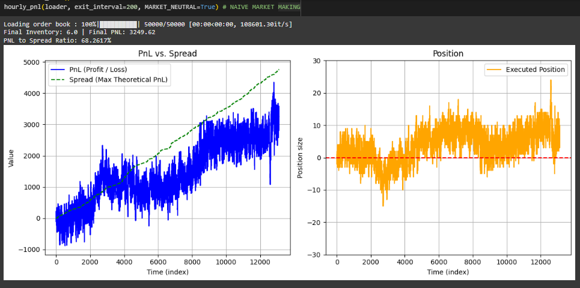
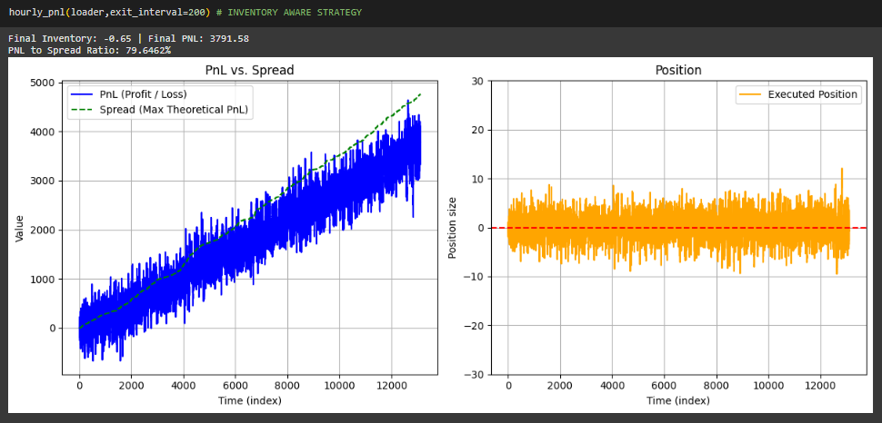

# Quote Craft

```md
Project Structure
│
└─── Part 1 : BTCUSDT-26Sep25 (Bitcoin derivative contract against Tether, with expiry on 26th Sept 2025)
│   │   
│   └─── Started with a Naive Market Making Strategy, as a benchmark.
│   └─── Compared it with our Inventory Aware Market Making Strategy.
│   └─── Implemented realistic slippage and execution.
│   └─── Tested our strategy on three consecutive days. 
│
└─── Part 2 : (Further Improvements)
│   │   
│   └─── Bayesian Hyperparameter Tuning using Optuna
│   └─── (future) Paper Trading using Alpaca API
```

## Part 1

This part of the project aims to implement an intelligent market-making strategy, generating calculated quotes on order book data. It is structured as Python notebooks designed to simulate quoting, execution, and inventory management in a high-frequency trading environment. The simulator aims to help understand and evaluate simple market-making behaviors under realistic market conditions.

### **`1_1_Market_Making.ipynb`**  
  Contains the **base version** of the simulator. Quotes are placed deterministically at spread-adjusted prices, and fills are assumed to happen immediately when a price match occurs. Useful for understanding core logic: quoting, execution, inventory management, and mark-to-market PnL tracking.

- ### Naive Market Neutral Strategy (benchmark)
  - **Quote Generation** : 
    ```math
    min\_price : \Delta = 0.1
    ```
    - Price
    ```math
      bid\_quote = best\_bid + \Delta
    ```
    ```math
      ask\_quote = best\_ask - \Delta
    ```
    - Volume
    ```math
      base\_volume : Q_0 = 0.001
    ```
    ```math
       bid\_vol = Q_0 
    ```
    ```math
       ask\_vol = Q_0 
    ```
  
  `(Performance Ratio = 68 %)`

- ### Inventory Aware Smart Strategy
  - **Quote Generation** : 
    ```math
    min\_price : \Delta = 0.1
    ```
    ```math
      price\_factor : \alpha = 3.0
    ```
    ```math
       Inventory\_bias : \phi = \min(\frac{|I_{volume}|}{I_{margin}},\alpha)
    ```
    ```math
    I_{margin} = 10 
    ```
    - Price
    ```math
    bid\_quote = best\_bid + \Delta - \lfloor\phi\rfloor . \Delta
    ```
    ```math
    ask\_quote = best\_ask - \Delta - \lfloor\phi\rfloor . \Delta
    ```
    - Volume
    ```math
     base\_volume : Q_0 = 0.001
    ```
    ```math
    vol\_factor : \beta = 0.25
    ```
    ```math
     bid\_vol = Q_0 (1 - \beta . \phi)
    ```
    ```math
    ask\_vol = Q_0 (1 + \beta . \phi) 
    ```
    - NOTE :
    ```math
    \alpha \cdot \beta \lt 1.0
    ```
  
  `(Performance Ratio = 79 %)`

This strategy saves us from the risk due to holding a big position.

### **`1_2_Realistic_Market_Making.ipynb`**  
  Extends the base simulator with two realism enhancements:
  - **Execution Probability:** Not all limit orders are assumed to be filled. Each order has a probabilistic chance of execution, simulating queue position and competition.
  - **Gaussian Slippage:** When trades are executed, the price is adjusted with a small random noise to reflect market slippage and non-instant execution.
  
As expected, this leads to more volatile PnL outcomes, and emphasizes the risk of non-execution and price impact. 

## Part 2

### Automated Hyperparameter Tuning : `2_1_HpTuning_Cold.ipynb`

- We to build a personalised `Cold_Tuner`. The name 'cold' because it takes some time (~5-15 minutes) to find the parameters, without using any initial guess.

- It uses [Optuna's TPESampler](https://optuna.readthedocs.io/en/stable/reference/samplers/generated/optuna.samplers.TPESampler.html) (Tree-structured Parzen Estimator). 

  >    Details:
  >-    It's a Bayesian optimization method based on probabilistic modeling.
  >-    It builds two models: one for "good" hyperparameter values and one for "bad" ones, and then chooses values that are more likely to improve performance.
  >-    Works well for non-convex, noisy, and high-dimensional search spaces. (default sampler in Optuna)

- To improve the time taken, we use [Optuna's Median Pruner](https://optuna.readthedocs.io/en/stable/reference/generated/optuna.pruners.MedianPruner.html).

  > Details:
  >- Since our `Realistic_Market_Making` is randomised. During the HpTuning, we might end up getting a set of Hps which performed well once (got lucky), but don't reflect a robust and promising strategy otherwise.
  >- To prevent against this, we run `MAX_REPS = 7` times and report the $\frac{mean(score)}{std(score)}$ to the tuner.
  >- This would demand 7 times the compute. To reduce that factor, We prune the runs with a poor score starting from `PRUNE_AFTER=3`.

Hyperparameters we're interested in, and their typical ranges :

- `Price_factor`    discrete vales in $[1,\infty)$

- `Vol_factor`      continuous values in $(0,1)$

- `inventory_cap`   continuous values in $(0,\infty)$

Score :
```math
score = \frac{final\_pnl}{std\_dev(pnl[t] - max\_theo[t]) \cdot std\_dev(Inv\_vol)}
```

(The Metric which optuna maximizes)

Potential Improvements : 

- The hidden variables of Market are bound to drift with time. 

- We can build a fast `Hot_Tuner` to frequently adjust the parameters. (more like a re-tuner)

- One could use local search on the initial guess given by the previous iterations, with [Optuna's GPS Sampler](https://optuna.readthedocs.io/en/stable/reference/samplers/generated/optuna.samplers.GPSampler.html)
 
### Paper Trading on Alpaca : (Future)

- Alpaca does not allow one to have a negative position in some instruments, including Bitcoin. This would not let us do Market Making as we want to.

- Moreover, the contract of our choice (BTCUSDT-26Sep25) is not available on Alpaca. So we are chose some other instrument.

- Moving to another instrument implies having to tune the hyperparameters again. Our `Hp_Tuner` saves the manual effort.

- So let's chose Coca Cola (KO) because it's my favorite drink ;)
